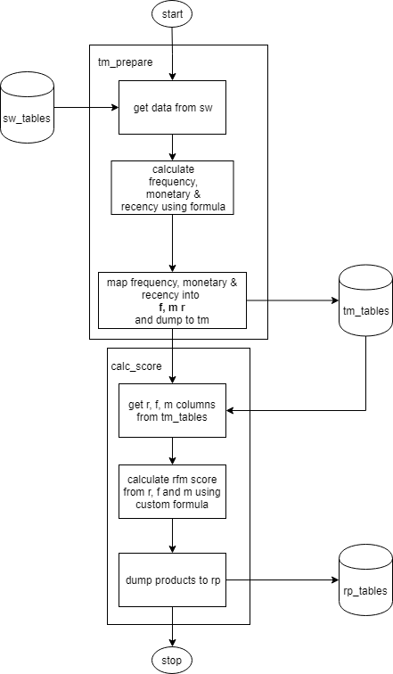

<h1>THIS IS A SAMPLE PROJECT. THE DEVELOPERS ARE KINDLY REQUESTED TO FOLLOW THIS OR SIMILAR PATTERN. THEY ARE ALSO REQUESTED TO CONTRIBUTE ANY IMPROVEMENTS TO THE STRUCTURE!</h1>

<h1>Generic RFM Calculation</h1>

<h2>Installing requirements</h2>
Under lib directory, there is a requirement.txt file. Install the requirements if you do not have the listed packages. Using virtual enviromnent is recommended.

```
$pip install lib/requirement.txt
```

<h2>Config Files</h2>
Under config directory, you will find two config files: config.ini and config.json.

<h3>config.ini</h3>
config.ini file is primarily for basic database information. The fields are pretty much self explanatory. The formula section has a brief description in the config file itself.

<h3>config.json</h3>
This is to control the formula aspects of the rfm model.

bin: This is basically the mapping of fields corresponding to r, m and f. Change these as necessary. If you have changed the mapping, you also need to change the formula section of config.ini file.

map_dict: Maps the binned rfm scores.

extra_facts: This is used to calculate the new facts from the existing facts. Keep in mind that these facts can be mapped using bin (discussed above). The user has flexibility to use different features from the sw table, calculate own facts using desired formulae and then use these facts to finally calculate rfm score.

quartile_bin: Specifies how the binning is done.

<li> division : How the percentile is distributed. The number of bins to generate.
<li> labels : What to name each division. **Strictly use numbers ranging from 1 to n, where n is the number of expected bins (the number of bins is controlled by division.)**

<h2>Running the Script</h2>
The main script that needs to be run is main.py.
There are several options that you have to keep in mind when running these scripts.

The basic way too run script is:

```
$ python  main.py [-h] -t {tm_prepare,calc_score} [-s {1,0}]
```

-t : means type of operation. There are two operation you can chose from.

<li>tm_prepare : prepares the tm table. The formula that you used is calculated here.
<li> calc_score : The actual rfm score is calculated here and is then the table is dumped to rp.

-s : gives you an option to calculate the tm data separately for POS and ATM if set to 1, else takes the whole data. **(make sure there is a field is_pos in sw data before setting this flag to 1)**

<figure>
  
  <figcaption>Fig.1 - Flow of main.py .</figcaption>
</figure>
